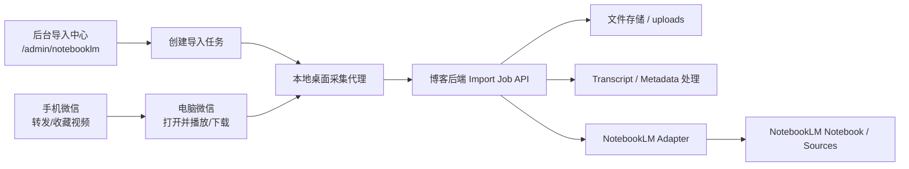

# NotebookLM 导入中心技术设计

状态: Proposed
日期: 2026-04-08
范围: 博客后台管理页 + Go 后端 + 本地桌面采集代理

## 1. 问题重述

当前需求表面上是“在博客后台增加一个导入按钮，把不同资源同步到 NotebookLM”，但真正的难点集中在微信视频号:

1. 手机端通常拿不到稳定、显式、可复用的视频链接。
2. 微信视频号不是以“公开 URL”作为一等交互对象，而是以“会话里可播放的内容”作为一等对象。
3. NotebookLM 最终需要的是它支持的 source 类型，而不是某个平台的内部链接语义。

因此，我们不再把“先拿到视频链接”设为系统前提，而是改成:

`手机负责选中内容，桌面负责提取内容，本地代理负责实体化内容，后台负责同步到 NotebookLM。`

## 2. 核心设计原则

### 2.1 内容实体优先于链接

链接只是某种内容表征，不是内容本体。对封闭平台，最稳定的导入目标是:

- 文件
- 文本
- 结构化元数据

而不是“某个可能随时变化的分享链接”。

### 2.2 手机负责指认，桌面负责提取

手机端是用户发现内容的地方，但不是适合做抓取、缓存监听、文件提取的地方。桌面端才有:

- 文件系统
- 缓存目录
- 下载目录
- 更可控的网络与进程环境

### 2.3 本地优先，远端编排

微信视频号内容获取尽量在用户自己的电脑上完成，后台只做:

- 导入任务编排
- 结果接收
- NotebookLM API 适配
- 状态追踪

### 2.4 允许语义降级，不允许任务完全卡死

如果拿不到原始 MP4，不应让整个任务失败，而应自动降级为:

1. 视频 + Transcript
2. 仅 Transcript
3. 标题 + OCR 文本 + 摘要

NotebookLM 的目标是理解内容，而不是验证我们是否拿到了“完美原件”。

### 2.5 任务化，而不是按钮直连

“导入”应设计成有状态作业，而不是一次性同步请求。原因:

- 本地采集可能持续数分钟
- 文件上传可能较大
- NotebookLM 同步需要分步骤执行
- 用户需要看见进度、失败原因、可重试点

## 3. 目标与非目标

### 3.1 目标

- 在后台提供统一的 NotebookLM 导入中心
- 支持四种资源类型:
  - 公共链接
  - 本地文件
  - 本地文件夹
  - 微信视频号内容
- 为微信视频号提供“不依赖手机拿链接”的工作流
- 将导入过程建模为可追踪的 Job
- 与 NotebookLM 的 notebook/source 能力解耦
- 允许后续平滑接入更强的逆向/解密能力

### 3.2 非目标

- 不在第一阶段实现一个通用的“任意 App 全自动抓包平台”
- 不把后端设计成远程爬虫服务，直接模拟微信客户端行为
- 不要求第一阶段解决所有加密视频的自动解密
- 不把手机端作为主要采集执行环境

## 4. 用户体验设计

## 4.1 后台入口

新增管理页:

- `/admin/notebooklm`

在侧边栏新增导航项:

- `NotebookLM 导入`

在仪表板新增快捷入口:

- `导入到 NotebookLM`

## 4.2 导入类型

导入中心只展示四种入口:

1. `资源链接`
2. `本地文件`
3. `本地文件夹`
4. `微信视频号`

注意:

- “微信视频号”不属于“资源链接”的子类
- 它是单独的“受限内容采集型资源”

## 4.3 微信视频号用户流程

### 手机端

用户只做两件事之一:

- 转发到文件传输助手
- 收藏

用户不需要拿链接。

### 桌面端

1. 用户打开后台 `NotebookLM 导入中心`
2. 选择 `微信视频号`
3. 创建导入任务
4. 后台显示一段简短指引:
   - 在电脑微信中打开目标视频
   - 播放一次或点击“下载内容”
   - 本地代理将自动尝试捕获文件
5. 本地代理监听下载/缓存目录
6. 捕获到视频或可导入文本后上传到后台
7. 后台同步到目标 Notebook
8. 页面展示结果:
   - 已导入视频
   - 已导入 Transcript
   - 失败原因或降级原因

## 5. 总体架构



## 6. 系统拆分

## 6.1 前端: NotebookLM 导入中心

建议新增文件:

- `frontend/src/pages/admin/NotebookLMImportCenter.tsx`
- `frontend/src/components/admin/NotebookLMImportCard.tsx`
- `frontend/src/components/admin/NotebookLMWechatCapturePanel.tsx`
- `frontend/src/components/admin/NotebookLMImportJobList.tsx`
- `frontend/src/services/notebooklmApi.ts`

职责:

- 创建 notebook
- 选择目标 notebook
- 创建导入任务
- 展示任务状态
- 为文件/文件夹/链接提供本地上传 UI
- 为微信视频号提供“桌面接力”引导与配对界面

UI 复用策略:

- 文件上传复用现有 `MediaUploader`
- 文件夹交互复用现有 `webkitdirectory` 模式
- 进度反馈复用 `AlgorithmFolderImportCard` 的结构
- Toast、加载态沿用现有后台组件风格

## 6.2 后端: Import Orchestrator

建议新增文件:

- `backend/internal/handlers/notebooklm.go`
- `backend/internal/services/notebooklm_service.go`
- `backend/internal/services/import_job_service.go`
- `backend/internal/models/notebooklm.go`
- `backend/migrations/XXX_create_notebooklm_import_tables.sql`

职责:

- 管理 NotebookLM notebook 元数据
- 创建与更新 import job
- 接收本地代理上传的 artifact
- 调用 NotebookLM API
- 记录失败原因与降级路径

## 6.3 本地桌面采集代理

建议新增目录:

- `backend/cmd/local-capture-agent`

推荐语言:

- Go

原因:

- 与现有后端语言一致
- 易于做单文件二进制分发
- 适合文件监听、目录扫描、HTTP 上传
- 更适合后续做 macOS / Windows 双平台发布

职责:

- 监听用户指定目录
- 记录导入任务开始前后的文件差异
- 捕获新生成的视频/文档/文本
- 识别可直接上传的内容
- 必要时触发本地解密或转写
- 将结果上传到后端

### MVP 不做的事

- 不强依赖固定微信缓存路径
- 不假设某个微信版本的目录结构永远稳定
- 不强依赖某个反向工程接口

MVP 只要求用户在首次配置时勾选要监听的目录，例如:

- `~/Downloads`
- 用户自定义的“微信下载目录”
- 用户手工指定的缓存导出目录

## 7. 数据模型

## 7.1 notebooklm_notebooks

用于缓存系统创建过的 NotebookLM notebook。

关键字段:

- `id`
- `user_id`
- `provider_notebook_id`
- `title`
- `description`
- `status`
- `last_synced_at`
- `created_at`
- `updated_at`

## 7.2 notebooklm_import_jobs

导入任务主表。

关键字段:

- `id`
- `user_id`
- `notebook_id`
- `source_type`
  - `web_url`
  - `local_file`
  - `local_folder`
  - `wechat_channel`
- `source_label`
- `source_input_json`
- `capture_mode`
  - `none`
  - `desktop_watch`
  - `desktop_watch_with_network_assist`
- `status`
- `stage`
- `progress`
- `error_code`
- `error_message`
- `degraded`
- `degraded_reason`
- `started_at`
- `finished_at`
- `created_at`
- `updated_at`

## 7.3 notebooklm_import_artifacts

记录每个任务产出的实体。

关键字段:

- `id`
- `job_id`
- `artifact_kind`
  - `video_file`
  - `audio_file`
  - `transcript_md`
  - `metadata_json`
  - `thumbnail_image`
  - `web_snapshot`
- `storage_type`
  - `upload_media`
  - `upload_file`
  - `inline_text`
- `storage_path`
- `mime_type`
- `file_size`
- `checksum`
- `origin`
  - `user_upload`
  - `desktop_agent`
  - `post_processed`
- `is_primary`
- `created_at`

## 8. 状态机设计

推荐状态:

- `created`
- `awaiting_capture`
- `capturing`
- `artifact_received`
- `processing`
- `syncing_to_notebooklm`
- `completed`
- `completed_with_degradation`
- `failed`
- `cancelled`

推荐 stage 文案:

- `等待桌面侧开始采集`
- `正在监听新文件`
- `已捕获原始视频`
- `正在生成转写文本`
- `正在上传到 NotebookLM`
- `已完成`
- `已降级为文本导入`

状态迁移原则:

- `status` 用于程序判断
- `stage` 用于前端文案
- `progress` 只做粗粒度，不追求 100% 精确

## 9. API 设计

统一路由前缀:

- `/api/notebooklm`

## 9.1 notebook 管理

### `GET /api/notebooklm/notebooks`

返回当前用户可选的 notebook 列表。

### `POST /api/notebooklm/notebooks`

创建一个 notebook。

请求体:

```json
{
  "title": "视频号学习资料",
  "description": "自动导入的视频与转写"
}
```

## 9.2 导入任务

### `POST /api/notebooklm/import-jobs`

创建导入任务。

请求体示例:

```json
{
  "notebook_id": 12,
  "source_type": "wechat_channel",
  "source_label": "超脱123 - 某条视频",
  "source_input": {
    "entry_mode": "desktop_watch"
  }
}
```

返回:

```json
{
  "job_id": 101,
  "status": "awaiting_capture",
  "pairing_token": "short-lived-token",
  "recommended_watch_paths": [
    "~/Downloads"
  ]
}
```

### `GET /api/notebooklm/import-jobs/:id`

查询单个任务状态。

### `GET /api/notebooklm/import-jobs`

分页查询任务列表。

### `POST /api/notebooklm/import-jobs/:id/retry`

重试失败任务。

## 9.3 本地代理接入

### `POST /api/notebooklm/import-jobs/:id/agent-handshake`

本地代理使用 `pairing_token` 换取短时上传凭证。

### `POST /api/notebooklm/import-jobs/:id/artifacts`

上传采集到的文件或文本。

表单字段建议:

- `artifact_kind`
- `mime_type`
- `is_primary`
- `file`
- `metadata`

### `POST /api/notebooklm/import-jobs/:id/complete-capture`

通知后端“本地采集阶段已结束”，后端进入处理和同步阶段。

## 10. NotebookLM 适配层

后端不要在 handler 中直接拼接 NotebookLM 请求，而应抽象成独立服务。

建议接口:

```go
type NotebookLMClient interface {
    CreateNotebook(ctx context.Context, input CreateNotebookInput) (Notebook, error)
    ListNotebooks(ctx context.Context, userID uint) ([]Notebook, error)
    BatchCreateSources(ctx context.Context, notebookID string, input BatchCreateSourcesInput) error
    UploadFileSource(ctx context.Context, notebookID string, input UploadFileSourceInput) error
}
```

导入策略映射:

- `web_url`
  - 公开网页 -> `BatchCreateSources(web)`
  - YouTube -> `BatchCreateSources(youtube)`
- `local_file`
  - 文档/音频/视频/图片 -> `UploadFileSource`
- `local_folder`
  - 遍历支持的文件，逐个 `UploadFileSource`
- `wechat_channel`
  - 优先上传 `video_file`
  - 同时补充 `transcript_md`
  - 无视频时至少上传 `transcript_md`

## 11. 微信视频号专属设计

## 11.1 关键重定义

微信视频号导入不再是“链接导入”，而是:

- `受限内容采集导入`

输入不是 URL，而是“用户刚刚在桌面微信中打开过的内容”。

## 11.2 三层解析器

### 模式 A: 文件副作用监听

这是 MVP 主路径。

流程:

1. 创建 job
2. 本地代理开始监听目录
3. 用户在电脑微信里播放或下载视频
4. 代理发现新增大文件
5. 代理校验 MIME / 扩展名 / 文件增长完成
6. 上传视频

优点:

- 不依赖链接
- 不依赖页面结构
- 对 UI 变化不敏感

### 模式 B: 文件监听 + 网络辅助

这是增强路径。

流程:

1. 先按模式 A 监听文件
2. 如识别到疑似加密视频或异常文件
3. 再尝试采集同次会话中的响应元数据
4. 若获得匹配的 `url + decode_key`，在本地完成解密
5. 上传解密后的 MP4

注意:

- `url` 和 `decode_key` 必须来自同一次响应
- 不应把“长期保存直链”作为系统目标

### 模式 C: 人工兜底

如果自动抓取失败:

- 允许用户直接上传已下载/录屏文件
- 或只上传 transcript

系统仍视为成功导入，只是标记为降级。

## 11.3 目录监听策略

MVP 建议采用“显式配置，而非硬编码路径”:

- 用户首次设置本地代理时，选择 1 到 3 个监听目录
- 每个任务记录 `watch_started_at`
- 代理只关注此时间之后出现或发生明显变化的文件

筛选信号:

- 扩展名为 `.mp4`、`.mov`、`.m4v`
- 文件大小超过阈值，例如 `3MB`
- 文件在短时间内持续增长后稳定
- 创建时间或修改时间晚于任务开始时间

## 11.4 加密与降级策略

如果视频直接可用:

- 上传原始视频

如果视频不可直接播放但检测为可解密:

- 本地解密
- 上传解密后视频

如果视频无法解密:

- 尝试提取音频
- 生成 transcript
- 将 transcript 导入 NotebookLM
- 任务标记为 `completed_with_degradation`

## 12. Transcript 管线

建议把 Transcript 作为默认增强能力，而不是异常能力。

原因:

- NotebookLM 对文本检索更友好
- 视频即使成功上传，文本仍然有额外价值
- 当文件体积过大或兼容性不足时，文本可以保底

建议产物:

- `video_file`
- `transcript_md`
- `metadata_json`

`transcript_md` 内容结构建议:

```md
# 视频转写

标题: 超脱123
来源: 微信视频号
导入时间: 2026-04-08 16:00

## 概要

...

## 完整转写

...
```

## 13. 与现有仓库的对齐

## 13.1 前端落点

现有后台路由可扩展点:

- `frontend/src/App.tsx`
- `frontend/src/pages/admin/AdminLayout.tsx`
- `frontend/src/pages/admin/AdminDashboard.tsx`

现有可复用组件:

- `frontend/src/components/admin/MediaUploader.tsx`
- `frontend/src/components/admin/AlgorithmFolderImportCard.tsx`
- `frontend/src/components/admin/algorithmFolderImport.ts`

## 13.2 后端落点

现有上传路由可复用:

- `/api/upload/file`
- `/api/upload/media`

相关文件:

- `backend/cmd/main.go`
- `backend/internal/handlers/media.go`
- `backend/internal/handlers/placeholder.go`

设计建议:

- 视频 artifact 走 `upload/media` 风格
- 文档 / transcript / json 走 `upload/file` 风格
- Import Job 自己维护状态，不直接复用上传接口返回状态

## 14. 分阶段实施

## Phase 1: 导入中心 MVP

范围:

- Notebook 列表/创建
- 链接导入
- 本地文件导入
- 本地文件夹导入
- Import Job 表结构与状态页

不包含:

- 微信视频号自动采集

价值:

- 先把 NotebookLM 主链路跑通

## Phase 2: 微信视频号桌面采集 MVP

范围:

- 本地 Go 代理
- 目录监听
- 与 Import Job 配对
- 捕获后上传视频
- 自动 Transcript

不包含:

- 网络辅助解密

价值:

- 先解决“手机拿不到链接”的核心阻塞

## Phase 3: 网络辅助增强

范围:

- 可选的会话级元数据采集
- 疑似加密文件识别
- 条件式解密

价值:

- 提高覆盖率，不改变主架构

## 15. 风险与应对

### 风险 1: 微信桌面端行为变化

应对:

- 不依赖单一路径
- 不依赖单一页面结构
- 以“新文件副作用”作为 MVP 主要信号

### 风险 2: 视频文件超过 NotebookLM 限制

应对:

- 自动生成 transcript
- 必要时只导入文本

### 风险 3: 本地代理过于侵入

应对:

- 只监听用户明确授权的目录
- 不做后台常驻全局抓包
- 每个 job 显式启动和停止监听

### 风险 4: 任务体验模糊

应对:

- 强制任务状态机
- 明确展示“等待采集 / 已捕获 / 正在同步 / 已降级”

## 16. 推荐的首批代码骨架

建议首批新增:

- `docs/notebooklm-import-center-design.md`
- `frontend/src/pages/admin/NotebookLMImportCenter.tsx`
- `frontend/src/services/notebooklmApi.ts`
- `backend/internal/handlers/notebooklm.go`
- `backend/internal/services/notebooklm_service.go`
- `backend/internal/services/import_job_service.go`
- `backend/internal/models/notebooklm.go`
- `backend/migrations/XXX_create_notebooklm_import_tables.sql`

第二批新增:

- `backend/cmd/local-capture-agent/main.go`

## 17. 最终判断

这个需求的正确设计，不是“让用户想办法先拿到视频号链接”，而是承认并吸收一个现实约束:

- 手机端无法优雅拿链接

然后围绕这个约束重构系统。

因此，系统的真正主线应该是:

`导入任务 -> 本地内容实体化 -> NotebookLM 同步`

而不是:

`导入任务 -> 想办法逼用户拿链接 -> 同步`

这会让微信视频号不再是一个“特例 bug”，而是导入系统里一种被良好建模的资源类型。

## 18. 参考资料

- NotebookLM Enterprise Overview: https://docs.cloud.google.com/gemini/enterprise/notebooklm-enterprise/docs/overview
- NotebookLM notebooks API: https://docs.cloud.google.com/gemini/enterprise/notebooklm-enterprise/docs/api-notebooks
- NotebookLM sources API: https://docs.cloud.google.com/gemini/enterprise/notebooklm-enterprise/docs/api-notebooks-sources
- Evil0ctal/WeChat-Channels-Video-File-Decryption: https://github.com/Evil0ctal/WeChat-Channels-Video-File-Decryption
- putyy/res-downloader: https://github.com/putyy/res-downloader
